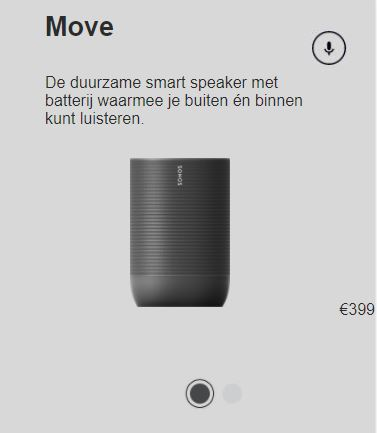

# Procesverslag
**Auteur:** -Luuk van den Bor-

Markdown cheat cheet: [Hulp bij het schrijven van Markdown](https://github.com/adam-p/markdown-here/wiki/Markdown-Cheatsheet). Nb. de standaardstructuur en de spartaanse opmaak zijn helemaal prima. Het gaat om de inhoud van je procesverslag. Besteedt de tijd voor pracht en praal aan je website.

## Bronnenlijst
1. Sonos | Draadloze speakers en Home Sound Systems. (z.d.). 
Geraadpleegd op 26 augustus 2020, van https://www.sonos.com/nl-nl/home

## Eindgesprek (week 7/8)

-dit ging goed & dit was lastig-

In de laatste paar weken ben ik bezig geweest met het voltooien van de tweede pagina en heb ik extra aandacht aan de surface
laag gegeven door middel van verschillende animaties. De animaties gingen beter dan verwacht door de oefeningen vanuit de
les. Ik heb het Sonos logo laten draaien en de lp's een glow up gegeven door middel van hovers. Soms struikelde ik nog wel
eens over een paar kleine foutjes, maar uiteindelijk ben ik erg tevreden met het eindresultaat wat ik heb neergezet voor een
blauwe piste!

**Screenshot(s):**

-screenshot(s) van je eindresultaat-

## Voortgang 3 (week 6)

### Stand van zaken

-dit ging goed & dit was lastig-

In de afgelopen week heb ik niet hele grote sprongen kunnen maken vanwege deadlines van andere vakken.
Wel heb ik nog een paar sections kunnen stylen op mijn tweede pagina. Dit ging eigenlijk beter dan verwacht. Hierna kan ik 
best wel wat elementen kopieren en kan ik me gaan focussen op de animations en het toevoegen van andere schoolopdrahten.

**Screenshot(s):**

-screenshot(s) van hoe ver je bent-

### Agenda voor meeting

-samen met je groepje opstellen-

We hebben gezamenlijk besloten dat we allemaal persoonlijke vragen opstellen die we per persoon gaan behandelen tijdens
de voortgangs meeting.

Mijn persoonlijke vragen:

- Hoe krijg ik mijn divjes beter gecentreerd dan justify content of display flex
- In hoeverre moet je animations erin hebben zitten als je best veel tijd kwijt bent aan het namaken van de huidige website

### Verslag van meeting

- Overal links/buttons toevoegen in plaats van h2,h3,p etc. (ook op navigatie)
- Aan de slag gaan met animaties (extra aandacht surface)
- class toevoegen op de speakerpage voor styling van de producten

## Voortgang 2 (week 5)

### Stand van zaken

-dit ging goed & dit was lastig-

Vanuit de vorige voortgangs meeting kon ik aardig op weg met mijn Z-index, toch was ik hier nog wat meer tijd aan kwijt dan gedacht
vanwege het precies rechtzetten met de hoeveelheden van de z-index. Nadat het eindelijk was gelukt ben ik verder gegaan met het
stukje javascript. Hier ben ik echt veel tijd aan kwijt geweest helaas. Met hulp van een mede-student ben ik weer op weg gekomen
en heb ik het uiteindelijk voor elkaar gekregen (had ik zelf nooit verwacht)! Nu is de homepagina helemaal af en focus ik me op
de tweede pagina (speaker pagina). Hier heb ik nog wat moeite met elementen linken aan de CSS omdat het vanuit een ander
html-document vandaan komt.   

**Screenshot(s):**

-screenshot(s) van hoe ver je bent-

### Agenda voor meeting

-samen met je groepje opstellen-

We hebben gezamenlijk besloten dat we allemaal persoonlijke vragen opstellen die we per persoon gaan behandelen tijdens
de voortgangs meeting.

Mijn persoonlijke vragen:

- Hoe kan ik sections vanuit een andere html document linken met dezelfde CSS pagina? (nth of type - other page?)
- In hoe verre moet er extra aandacht aan de surface laag worden gegeven als je al veel moeite hebt met het namaken van de website?

### Verslag van meeting

Tips van Jesse:

- Flexbox toevoegen in de footer (3 koloms)
- Hamburger menu stylen van streepjes naar kruisje (Als genoeg tijd over is)
- Kijken of bepaalde elementen nog iets meer responsive kunnen

Extra to do's voor mezelf:

- Javascript linken aan de tweede pagina
- ID's toevoegen aan de mains van beide pagina's om individueel te stylen
- Link toevoegen in het hidden menu voor linken naar de tweede pagina
- Animation in het hamburger menu voor extra surface aandacht 

## Voortgang 1 (week 3)

### Stand van zaken

-dit ging goed & dit was lastig-

Op het begin was het voor mij erg lastig om alle css regels weer op de juiste manier toe te passen waardoor
het proces wat langzaam van start ging. Nadat ik langs de eerste complicaties was gekomen, ging het positioneren eigenlijk
best wel soepel en redelijk snel. Het gene wat voor mij nog erg lastig is, is het gebruiken van de z-index voor de overlay
van verschillende images. Ook het javascript gedeelte heb ik voor nu nog even uitgesteld omdat ik daar wat meer moeite mee heb.

**Screenshot(s):**

-screenshot(s) van hoe ver je bent-

### Agenda voor meeting

-samen met je groepje opstellen-

- Z-index versoepeling
- Tips & Tricks Javascript

### Verslag van meeting

De studentenassistenten hebben mij laten zien hoe ik het beste de Z-index kan toepassen en een paar tricks meegegeven
om javascript zo makkelijk mogelijk in mijn website te verwerken. Ook hebben ze gezegd dat ik beter de sliders kan laten 
zitten en me moet gaan focussen op de andere sections.

## Intake (week 1)

**Je startniveau:** Blauw

**Je focus:** Ik kies voor de extra aandacht aan de surface laag.

**Je opdracht:** https://www.sonos.com/nl-nl/home

**Screenshot(s):** 

Desktop:

Mobile:

**Breakdown-schets(en):**

Section 1:

Section 2:

Section 3:

Section 4:

