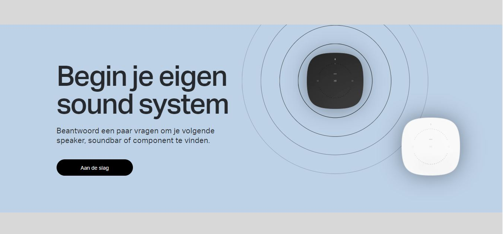

# Procesverslag
**Auteur:** -Luuk van den Bor-

Markdown cheat cheet: [Hulp bij het schrijven van Markdown](https://github.com/adam-p/markdown-here/wiki/Markdown-Cheatsheet). Nb. de standaardstructuur en de spartaanse opmaak zijn helemaal prima. Het gaat om de inhoud van je procesverslag. Besteedt de tijd voor pracht en praal aan je website.

## Bronnenlijst
1. Sonos | Draadloze speakers en Home Sound Systems. (z.d.). 
Geraadpleegd op 26 augustus 2020, van https://www.sonos.com/nl-nl/home

## Eindgesprek (week 7/8)

-dit ging goed & dit was lastig-

**Screenshot(s):**

-screenshot(s) van je eindresultaat-

## Voortgang 3 (week 6)

-same as voortgang 1-

## Voortgang 2 (week 5)

-same as voortgang 1-

## Voortgang 1 (week 3)

### Stand van zaken

-dit ging goed & dit was lastig-

Op het begin was het voor mij erg lastig om alle css regels weer op de juiste manier toe te passen waardoor
het proces wat langzaam van start ging. Nadat ik langs de eerste complicaties was gekomen, ging het positioneren eigenlijk
best wel soepel en redelijk snel. Het gene wat voor mij nog erg lastig is, is het gebruiken van de z-index voor de overlay
van verschillende images. Ook het javascript gedeelte heb ik voor nu nog even uitgesteld omdat ik daar wat meer moeite mee heb.

**Screenshot(s):**

-screenshot(s) van hoe ver je bent-

### Agenda voor meeting

-samen met je groepje opstellen-

- Z-index versoepeling
- Tips & Tricks Javascript

### Verslag van meeting

-na afloop snel uitkomsten vastleggen-

## Intake (week 1)

**Je startniveau:** Blauw

**Je focus:** Ik kies voor de extra aandacht aan de surface laag.

**Je opdracht:** https://www.sonos.com/nl-nl/home

**Screenshot(s):** 

Desktop:

Mobile:

**Breakdown-schets(en):**

Section 1:

Section 2:

Section 3:

Section 4:

